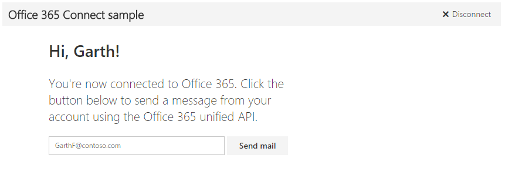

# Microsoft Graph Connect Sample for Python

Connecting to Office 365 is the first step every app must take to start working with Office 365 services and data. This sample shows how to connect and then call one API through the Microsoft Graph API (previously called Office 365 unified API), and uses the Office Fabric UI to create an Office 365 experience.

> Note: Try out the [Get started with Office 365 APIs](http://dev.office.com/getting-started/office365apis?platform=option-python#setup) page which simplifies registration so you can get this sample running faster.



## Prerequisites

To use the Office 365 Python Connect sample, you need the following:
* [Python 3.4.3](https://www.python.org/downloads/)
* [Django 1.8](https://docs.djangoproject.com/en/1.8/intro/install/)
* An Office 365 account. You can sign up for [an Office 365 Developer subscription](https://aka.ms/devprogramsignup) that includes the resources that you need to start building Office 365 apps.

     > Note: If you already have a subscription, the previous link sends you to a page with the message *Sorry, you can’t add that to your current account*. In that case use an account from your current Office 365 subscription.
* A Microsoft Azure tenant to register your application. Azure Active Directory (AD) provides identity services that applications use for authentication and authorization. A trial subscription can be acquired here: [Microsoft Azure](https://account.windowsazure.com/SignUp).

     > Important: You also need to make sure your Azure subscription is bound to your Office 365 tenant. To do this, see the Active Directory team's blog post, [Creating and Managing Multiple Windows Azure Active Directories](http://blogs.technet.com/b/ad/archive/2013/11/08/creating-and-managing-multiple-windows-azure-active-directories.aspx). The section **Adding a new directory** will explain how to do this. You can also see [Set up your Office 365 development environment](https://msdn.microsoft.com/office/office365/howto/setup-development-environment#bk_CreateAzureSubscription) and the section **Associate your Office 365 account with Azure AD to create and manage apps** for more information.
* A client ID, client secret, and redirect URI values of an application registered in Azure. This sample application must be granted the **Send mail as signed-in user** and **Send mail as signed-in user** permissions for the **Microsoft Graph** application. [Add a web server application in Azure](https://msdn.microsoft.com/office/office365/HowTo/add-common-consent-manually#bk_RegisterServerApp) and [grant the proper permissions](https://github.com/OfficeDev/O365-Python-Microsoft-Graph-Connect/wiki/Grant-permissions-to-the-Connect-application-in-Azure) to it.

     > Note: During the app registration process, make sure to specify **http://127.0.0.1:8000/connect/get_token/** as the **Sign-on URL**.

## Configure and run the app

1. Using your favorite IDE, open **config.py** in the *connect* directory.
2. Replace *ENTER_YOUR_CLIENT_ID* with the client ID of your registered Azure application.
3. Replace *ENTER_YOUR_SECRET* with a key generated on the **Configure** page of your app in the Microsoft Azure Management Portal.
4. Install the [Requests: HTTP for Humans module](http://docs.python-requests.org/en/latest/) from the command line by running ```pip install requests```.
5. Set up the server by running ```python manage.py migrate```. [This command](https://docs.djangoproject.com/en/1.8/ref/django-admin/#django-admin-migrate) will synchronize the database state with the current set of migrations.
6. Start the development server by running ```python manage.py runserver```.
7. Navigate to ```http://127.0.0.1:8000/``` in your web browser.

To learn more about the sample, see [Python walkthrough on graph.microsoft.io](http://graph.microsoft.io/docs/platform/python).

<a name="contributing"></a>
## Contributing ##

If you'd like to contribute to this sample, see [CONTRIBUTING.MD](/CONTRIBUTING.md).

This project has adopted the [Microsoft Open Source Code of Conduct](https://opensource.microsoft.com/codeofconduct/). For more information see the [Code of Conduct FAQ](https://opensource.microsoft.com/codeofconduct/faq/) or contact [opencode@microsoft.com](mailto:opencode@microsoft.com) with any additional questions or comments.  

## Questions and comments

We'd love to get your feedback about the Office 365 Python Connect sample. You can send your questions and suggestions to us in the [Issues](https://github.com/OfficeDev/O365-Python-Microsoft-Graph-Connect/issues) section of this repository.

Your feedback is important to us. Connect with us on [Stack Overflow](http://stackoverflow.com/questions/tagged/office365+or+microsoftgraph). Tag your questions with [MicrosoftGraph] and [office365].
  
## Additional resources

* [Office Dev Center](http://dev.office.com/)
* [Microsoft Graph API](http://graph.microsoft.io)
* [Office UI Fabric](http://dev.office.com/fabric)

## Copyright
Copyright (c) 2015 Microsoft. All rights reserved.
